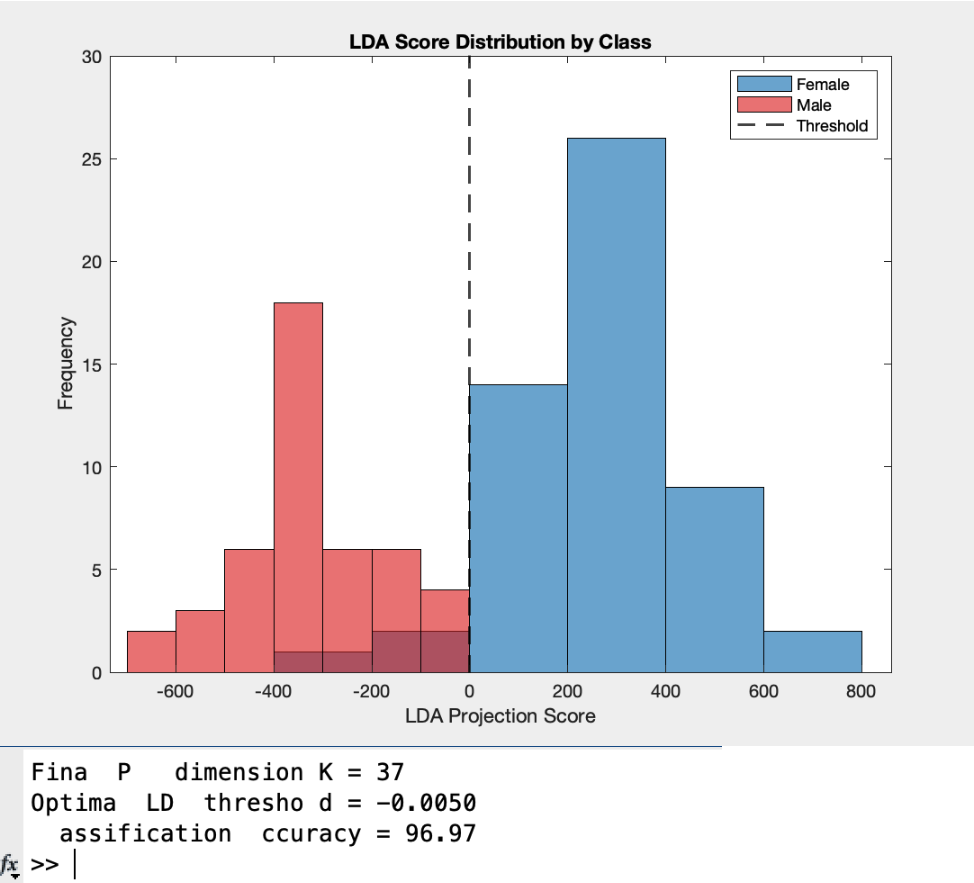

# 🧠 Facial Classification using PCA + LDA

This project implements a facial gender classification pipeline by combining **Principal Component Analysis (PCA)** and **Linear Discriminant Analysis (LDA)**. It was developed as part of a multi-day exploration of dimensionality reduction and classification techniques in face data.

---

## 📁 Project Overview

The classification system aims to distinguish between male and female faces using a combination of unsupervised (PCA) and supervised (LDA) learning techniques. The pipeline includes:

1. **Dimensionality Reduction with PCA**
2. **Class Discrimination with LDA**
3. **Threshold-based Binary Classification**

---

## 📊 Methodology

### 🔹 Day 1: PCA Component Selection
- Applied PCA to the dataset to reduce dimensionality while retaining significant variance.
- Selected optimal principal components (**K = 37, 36**) based on performance from Day 1.

### 🔹 Day 2: LDA Direction Learning
- Computed the **optimal LDA direction** using labeled gender data.
- LDA projects data to a 1D space maximizing class separability.

### 🔹 Day 3: Threshold Tuning and Final Evaluation
- Projected all samples onto the learned LDA direction.
- Tuned classification threshold to **-0.0050**.
- Achieved final classification **accuracy of ~96.97%**.

---

## 📈 Results

- **Accuracy:** ~96.97%
- **Optimal PCA Components:** 36–37
- **LDA Threshold:** -0.0050
- **Projection Outcome:** Clear separation between male and female scores in the 1D LDA space.

---

## 📸 Output Result

Below is a sample output showing the projection of facial images onto the learned LDA direction. Each point represents a sample, colored or labeled based on its true gender class.

---

## 🧪 Error Analysis

Although overall performance was high, analyzing **misclassified images** could have provided valuable insight into:
- Ambiguous facial features or lighting
- Overlap in feature representation
- Potential bias in training data

This step could help pinpoint areas where the classifier is confused and guide future improvements (e.g., feature augmentation, preprocessing refinements).

---

## 🛠️ Requirements

- MATLAB (Tested with R2021a or later)
- Labeled face dataset (with gender annotations)
- Scripts from previous PCA and LDA implementation days

---
